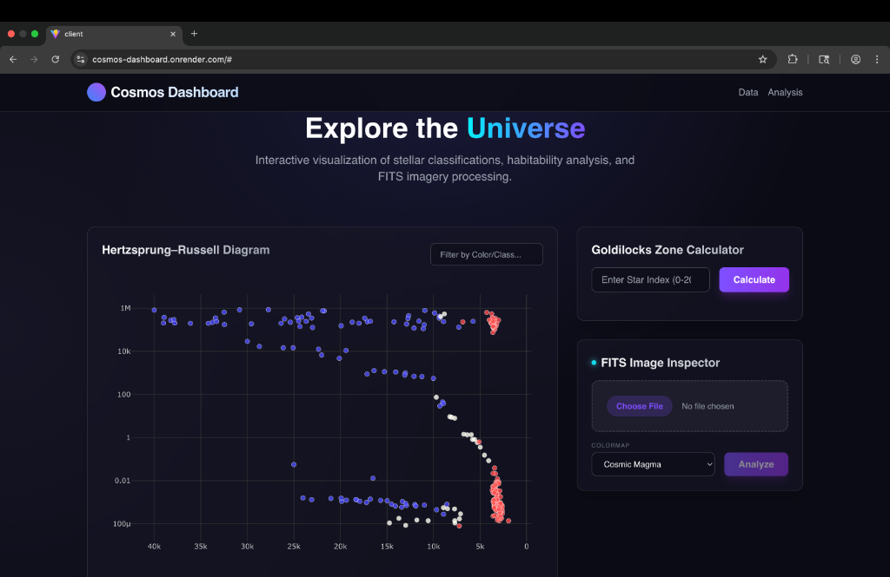
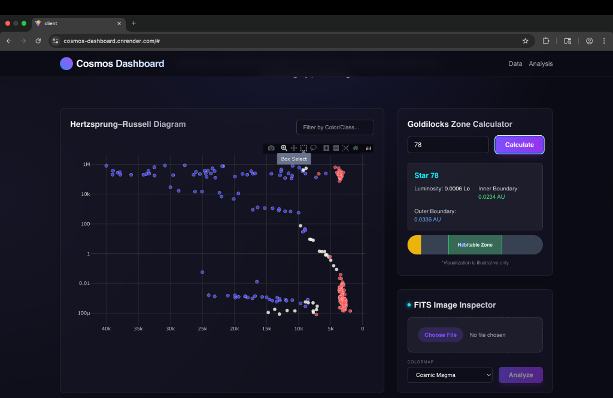
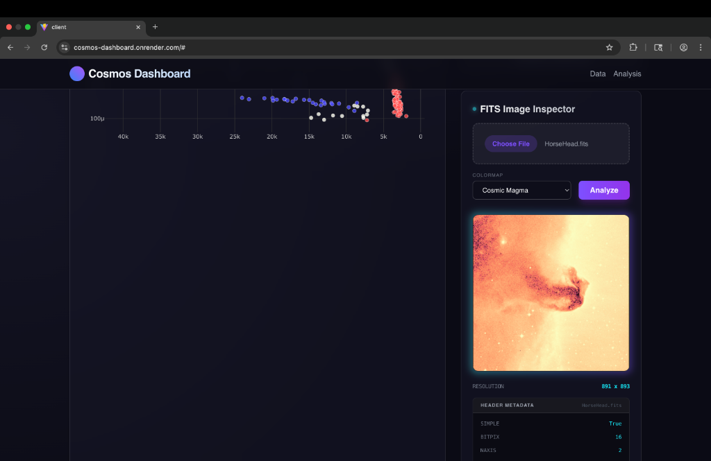
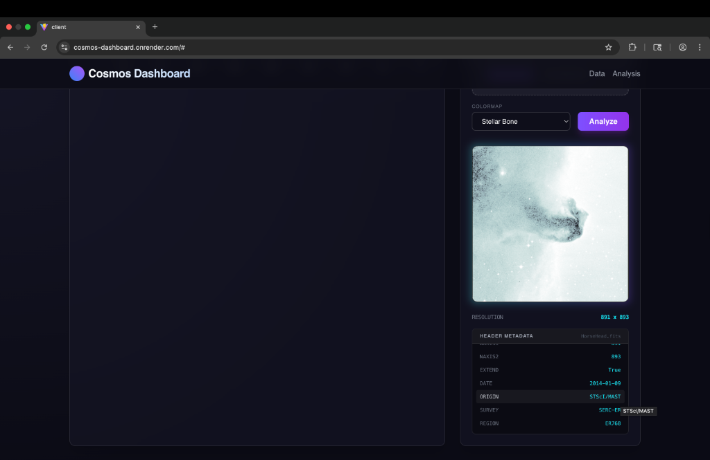
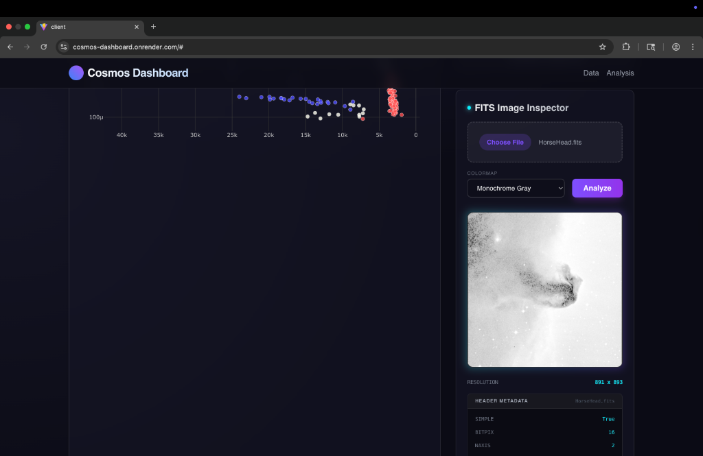

# 🌌 Cosmos Dashboard: Astronomical Visualization

A modern, full-stack dashboard for exploring the stars. Transform raw astronomical data and FITS imagery into interactive, scientific visualizations.

## ✨ Key Features

- **🔭 Interactive H-R Diagram**: Explore Star Temperature vs. Luminosity using a dynamic Plotly scatter plot with real-time filtering and tooltips.
- **🖼️ FITS Image Inspector**: Upload `.fits` files to extract header metadata and generate a processed preview with adjustable colormaps (Cosmic Magma, Inferno, Monochrome Gray).
- **🌍 Habitability Calc**: Calculate the "Goldilocks Zone" (Habitable Zone inner/outer boundaries) for stars based on their luminosity.
- **🔍 Stellar Search**: Instant filtering of the star catalog by color, spectral class, or type.

## � Screenshots


*Full dashboard view with H-R Diagram, Goldilocks Zone Calculator, and FITS Inspector.*


*Interactive Hertzsprung-Russell Diagram with real-time habitability zone calculations for selected stars.*


*FITS Image Inspector rendering the Horsehead Nebula with the Cosmic Magma colormap.*


*FITS image visualization using the custom Stellar Bone colormap with detailed header metadata.*


*Classic monochrome grayscale rendering for scientific analysis.*

## �🛠️ Technology Stack

| Layer | Technology |
| :--- | :--- |
| **Frontend** | React (Vite), Tailwind CSS, Plotly.js, Axios |
| **Backend** | Python (FastAPI), Uvicorn |
| **Data Science** | Astropy, NumPy, Pandas, Matplotlib |
| **DevOps** | Docker (Multi-stage build) |

---

## 🚀 Getting Started

### 1. Quick Start (Local Development)
The project includes a helper script that launches both the backend and frontend:

```bash
chmod +x start.sh
./start.sh
```
- **Dashboard**: [http://localhost:5173](http://localhost:5173)
- **API Docs**: [http://localhost:8000/docs](http://localhost:8000/docs)

### 2. Manual Setup
If you prefer manual control:
- **Backend**: Navigate to `/server`, create a `venv`, and `pip install -r requirements.txt`.
- **Frontend**: Navigate to `/client`, run `npm install` and `npm run dev`.

---

## ☁️ Deployment

### Docker
The project is containerized for seamless deployment to platforms like **Render**, **Railway**, or **Fly.io**:

```bash
docker build -t cosmos-dashboard .
docker run -p 8000:8000 cosmos-dashboard
```

### Production Mode
In production, the FastAPI server serves the compiled React frontend from the `client/dist` directory on a single port for maximum efficiency.

---

## 📂 Project Structure
```text
Astronomical_Visualization/
├── client/           # React Frontend
├── server/           # FastAPI Backend
├── data/             # CSV and FITS datasets
├── notebooks/        # Original Research & Jupyter Notebooks
└── Dockerfile        # Production Build Logic
```

---
*Created for the love of space and data.* 🌠
